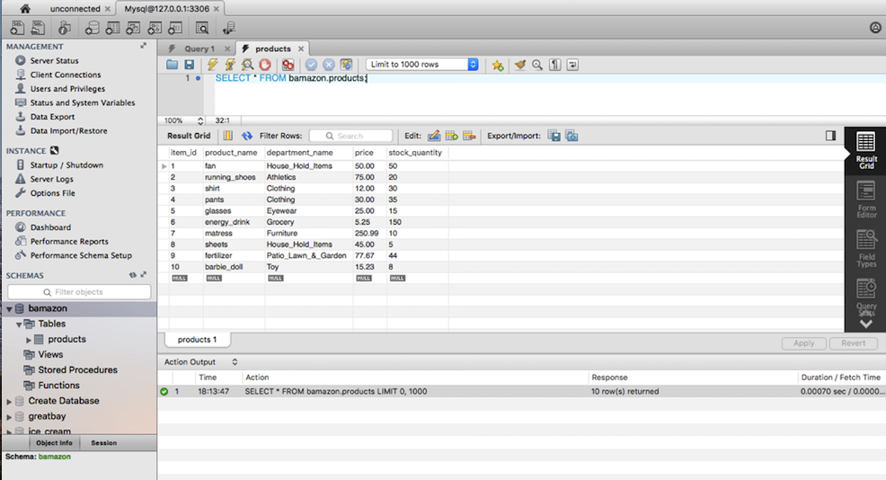
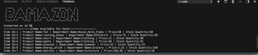

# **BAMAZON ** #

This is an Amazon-like storefront that takes in orders from customers and updates the stock from the store’s inventory.

## Technologies Used ##
-MySQL

-Node.js

-JavaScript

## npm Packages: ##
- [inquirer](https://www.npmjs.com/package/inquirer "inquirer") - A collection of common interactive command line user interfaces.
- [MySQL]( https://www.npmjs.com/package/mysql "MySQL") - This is a node.js driver for mysql.

## How it works: ##
- Step 1: BAMAZON prompts customer for the ID of the product they would like to buy. The app will check if the ID is valid.
- Step 2: The app will prompt the customer to enter the quantity of the product they would like to purchase. 
- Step 3: Once the customer has placed their order, BAMAZON will check if the store has enough of the product in stock to meet the customer’s request.
- If there isn’t enough product in stock for purchase, the app will log “Insufficient Quantity” and will cancel the order.
- If there is enough product in stock for purchase, the app will total and show the amount owed for the placed order.
- Step 4: The app will update the SQL database to reflect the remaining quantity.

